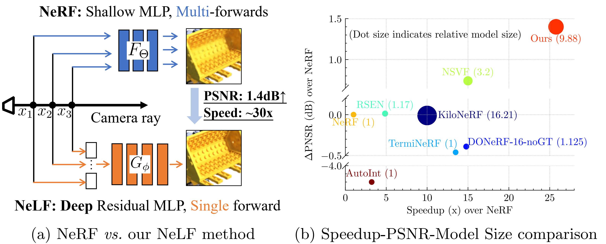

# R2L: Distilling NeRF to NeLF

<div align="center">
    <a></a>
    &nbsp
    <a></a>
</div>

This repository is for the new neral light field (NeLF) method introduced in the following ECCV'22 paper:
> **R2L: Distilling Neural Radiance Field to Neural Light Field for Efficient Novel View Synthesis [[Arxiv](https://arxiv.org/abs/2203.17261)] [[Project](https://snap-research.github.io/R2L/)]** \
> [Huan Wang](http://huanwang.tech/) [1,2], [Jian Ren](https://alanspike.github.io/) [1], [Zeng Huang](https://zeng.science/) [1], [Kyle Olszewski](https://kyleolsz.github.io/) [1], [Menglei Chai](https://mlchai.com/) [1], [Yun Fu](http://www1.ece.neu.edu/~yunfu/) [2], and [Sergey Tulyakov](http://www.stulyakov.com/) [1] \
> [1] Snap Inc. [2] Northeastern University \
> Work done when Huan was an intern at Snap Inc.

**[TL;DR]** We present R2L, a deep (88-layer) residual MLP network that can represent the neural *light* field (NeLF) of complex synthetic and real-world scenes. It is featured by compact representation size (~20MB storage size), faster rendering speed (~30x speedup than NeRF), significantly improved visual quality (1.4dB boost than NeRF), with no whistles and bells (no special data structure or parallelism required).

<div align="center">
    <a></a>
</div>


## Reproducing Our Results
### 1. Set up (original) data
```bash
sh scripts/download_data_v2.sh
```

### 2. Set up environment with Anaconda
- `conda create --name R2L python=3.9.6`
- `conda activate R2L`
- `pip install -r requirements.txt` (torch==1.9.0, torchvision==0.10.0)

### 3. Test our trained R2L models
- Download our trained models here.
- Run
```bash
CUDA_VISIBLE_DEVICES=0 python run_nerf_raybased.py --model_name nerf_v3.2 --config configs/lego_noview.txt --n_sample_per_ray 16 --netwidth 256 --netdepth 88 --datadir_kd data/nerf_synthetic/lego_v8_Rand_Origins_Dirs_4096RaysPerNpy_10kImages --use_residual --cache_ignore data --trial.ON --trial.body_arch resmlp --pretrained_ckpt R2L_models/W256D88__blender_lego__400x400.tar --render_only --render_test --testskip 1 --project Test__R2L_W256D88__blender_lego__400x400
```  
Here we only show the example of scene `lego`. You may test on other scenes simply by changing all the `lego` word segments to other scene names.
 
### 4. Train R2L models
There are two major steps in R2L training. (1) Use *pretrained* NeRF model to generate synthetic data and train R2L network on the synthetic data -- this step can make our R2L model perform *comparably* to the NeRF teacher; (2) Finetune the R2L model in (1) with the *real* data -- this step will further boost the performance and make our R2L model *outperform* the NeRF teacher.

The detailed step-by-step training pipeline is as follows.

Step 1. Pretrain a NeRF model (we simply follow the instructions [here](https://github.com/yenchenlin/nerf-pytorch))

Here we only show the example of scene `lego`. You may test on other scenes simply by changing all the `lego` word segments to other scene names.
```bash
CUDA_VISIBLE_DEVICES=0 python3 run_nerf.py --config configs/lego.txt --screen --cache_ignore data,__pycache__,torchsearchsorted,imgs --project nerf__blender_lego__400x400
```

Step 2. Use the pretrained NeRF model to generate synthetic data (saved in .npy format):
```bash
CUDA_VISIBLE_DEVICES=0 python3 run_nerf_create_data.py --create_data rand --config configs/lego.txt --teacher_ckpt Experiments/nerf__blender_lego__400x400*/weights/200000.tar --n_pose_kd 10000 --datadir_kd data/nerf_synthetic/lego:data/nerf_synthetic/lego_pseudo_400x400_images10k --screen --cache_ignore data,__pycache__,torchsearchsorted,imgs --project nerf__blender_lego__CreatePseudoData

```
Step 3. Train R2L model on the synthetic data:
```bash
CUDA_VISIBLE_DEVICES=0 python run_nerf_raybased.py --model_name R2L --config configs/lego_noview.txt --n_sample_per_ray 16 --netwidth 256 --netdepth 88 --datadir_kd data/nerf_synthetic/lego_pseudo_400x400_images10k --n_pose_video 20,1,1 --N_iters 1200000 --N_rand 20 --data_mode rays --hard_ratio 0.2 --hard_mul 20 --use_residual --trial.ON --trial.body_arch resmlp --num_worker 8 --warmup_lr 0.0001,200 --cache_ignore data,__pycache__,torchsearchsorted,imgs --screen --project R2L__blender_lego__400x400
```

Step 4. Convert original real data (images) to our .npy format:
```bash
python convert_original_data_to_rays_blender.py --splits train --datadir data/nerf_synthetic/lego
```

Step 5. Finetune the R2L model in Step 3 on the data in Step 4:
```bash
CUDA_VISIBLE_DEVICES=0 python run_nerf_raybased.py --model_name R2L --config configs/lego_noview.txt --n_sample_per_ray 16 --netwidth 256 --netdepth 88 --datadir_kd data/nerf_synthetic/lego_realtrain_400x400 --n_pose_video 20,1,1 --N_iters 1600000 --N_rand 20 --data_mode rays --hard_ratio 0.2 --hard_mul 20 --use_residual --cache_ignore data,__pycache__,torchsearchsorted,imgs  --screen --trial.ON --trial.body_arch resmlp --num_worker 8 --warmup_lr 0.0001,200 --save_intermediate_models --pretrained_ckpt Experiments/R2L__blender_lego__400x400_SERVER*/weights/ckpt_1200000.tar --resume --project R2L__blender_lego__400x400__ft
```
Note, this step is pretty fast and prone to overfitting, so do not finetune it too much. We simply set the finetuning steps based on our validation.


## Results
See more results and videos on our [project webpage](https://snap-research.github.io/R2L/).


## Acknowledgments
In this code we refer to the following implementations: [nerf-pytorch](https://github.com/yenchenlin/nerf-pytorch), [smilelogging](https://github.com/MingSun-Tse/smilelogging). Great thanks to them! We especially thank [nerf-pytorch](https://github.com/yenchenlin/nerf-pytorch). Our code largely builds upon their wonderful implementation. We also greatly thank the anounymous ECCV'22 reviewers for the constructive comments to help us improve the paper.

## Reference

If our work or code helps you, please consider to cite our paper. Thank you!

    @inproceedings{wang2022r2l,
      author = {Huan Wang and Jian Ren and Zeng Huang and Kyle Olszewski and Menglei Chai and Yun Fu and Sergey Tulyakov},
      title = {R2L: Distilling Neural Radiance Field to Neural Light Field for Efficient Novel View Synthesis},
      booktitle = {ECCV},
      year = {2022}
    }


